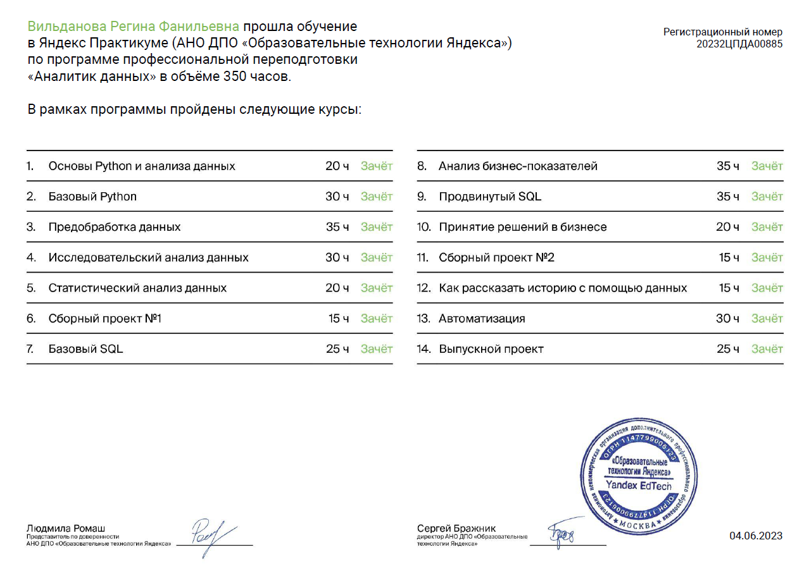

# Data Analyst (Yandex.Practicum)

## Описание
В репозитории представлены проекты курса [Аналитик данных  (Яндекс.Практикум)](https://praktikum.yandex.ru/data-analyst/)

## Основные инструменты и навыки

- Языки: Python, SQL
- Анализ данных: библиотеки Pandas, NumPy, SciPy, Statsmodels
-	Визуализация: Matplotlib, Plotly, Seaborn
-	Построение дашбордов: Tableau
-	Метрики юнит-экономики, когортный анализ
-	А/В-тестирование
-	Работа с гипотезами

## Проекты
| № | Название и ссылка | О чём проект | Навыки и инструменты |
|:---|:------------|:------------|:------------|
| 1  | [Сборный проект I. Анализ рынка продаж компьютерных игр](https://github.com/regvild/yap-games-success-analysis)  | Ищем закономерности в данных о продаже игр и выявляем те, которые определяют их успешностьдля ставки на потенциально популярный продукт и спланировать рекламные кампании| `Python` `Pandas` `NumPy` `Math` `Matplotlib` `предобработка данных` `EDA` `описательная статистика` `проверка статистических гипотез` |
| 2  | [SQL. Анализ базы книжного сервиса](https://github.com/regvild/yap-book-analysis-sql) |Выгружаем различные данные с книжного сервиса для формулировки ценностного предложения для нового продукта с помощью SQL| `SQL` `выгрузка данных`|
| 3  | [Выпускной проект. Банки — сегментация пользователей по потреблению продуктов.](https://github.com/regvild/yap-banks_segmentation) | Сегментация пользователей банковских продуктов по потреблению для понимания поведения клиентов, интересных особенностей,выявления точек роста и признаков, сигнализирующих о скором уходе клиента.| `Python` `Pandas` `Matplotlib` `Seaborn` `классификация` `кластеризация` `Tableau` `построение дашбордов` `A/B-тестирование` `проверка статистических гипотез`|

# Программа обучения

